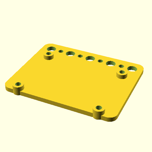
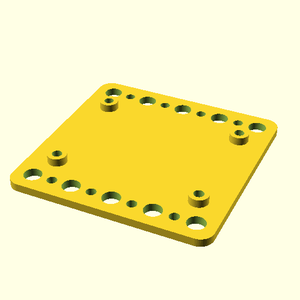

# Oomlout oobb holder dc to dc converter

## parts

### holder_dc_to_dc_converter_5_width_4_height_3_mm_depth_dc_to_dc_converter_buck_style_300_watt_20_amp_top_holes_extra
* link: [/holder_dc_to_dc_converter_5_width_4_height_3_mm_depth_dc_to_dc_converter_buck_style_300_watt_20_amp_top_holes_extra](holder_dc_to_dc_converter_5_width_4_height_3_mm_depth_dc_to_dc_converter_buck_style_300_watt_20_amp_top_holes_extra)  
  
 

### holder_dc_to_dc_converter_5_width_5_height_3_mm_depth_dc_to_dc_converter_buck_style_300_watt_20_amp_top_and_bottom_holes_extra
* link: [/holder_dc_to_dc_converter_5_width_5_height_3_mm_depth_dc_to_dc_converter_buck_style_300_watt_20_amp_top_and_bottom_holes_extra](holder_dc_to_dc_converter_5_width_5_height_3_mm_depth_dc_to_dc_converter_buck_style_300_watt_20_amp_top_and_bottom_holes_extra)  
  
 
